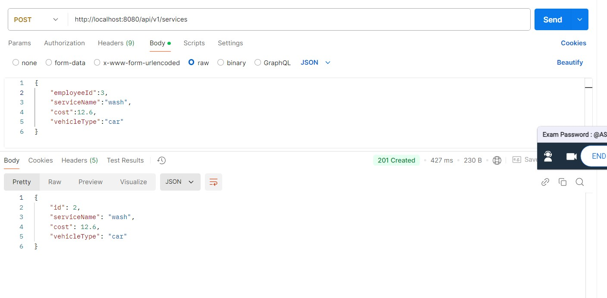

# Vehicle-Service-Center

# post employee images
POST /employees

# GET all employees
GET /employees

# GET employee by id

GET /employees/{id}

# PATCH employee by id

PATCH /employees/{id}

# TEST FOR POST EMPLOYEE

# ASSIGN SERVICE

